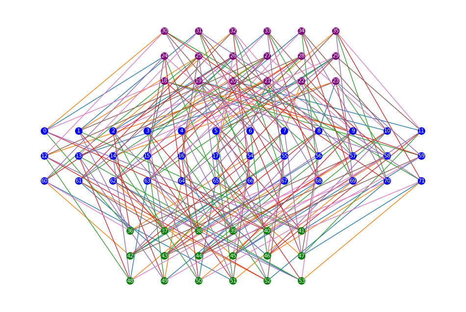

# QUITS: A Modular QLDPC Code circUIT Simulator

QUITS is a modular and flexible circuit-level simulator for quantum low-density parity-check (QLDPC) codes. It is designed so users can choose and mix different options for each module independently: code construction, circuit strategy, decoder, and noise model.

*Example QLDPC code (Balanced Product Cyclic code) Tanner graph with cardinal circuit scheduling.*



## Modular Architecture

QUITS is organized into clear modules, enabling flexible choice for each component:

- `quits.qldpc_code`: QLDPC code families, code objects, and bring-your-own parity-check-matrix workflows.
- `quits.qldpc_code.circuit_construction`: circuit-construction strategies and options.
- `quits.decoder`: sliding-window phenomenological/circuit-level decoders, with flexibility in inner decoders (e.g. BP-OSD, BP-LSD, bring-your-own decoder).
- `quits.noise.ErrorModel`: structured noise-model configuration (e.g. idling/single-qubit-gate/two-qubit-gate/SPAM error rates) for circuit generation.

For HGP codes, QUITS also includes a classical LDPC generator in `quits.ldpc_util`, including `generate_ldpc` and `generate_ldpc_good_girth`.

Supported code families include:

- [Hypergraph Product (HGP) codes](doc/01A_codes_basics.ipynb#hgp-code)
- [Quasi-cyclic Lifted Product (QLP) codes](doc/01A_codes_basics.ipynb#qlp-code)
- [Balanced Product Cyclic (BPC) codes](doc/01A_codes_basics.ipynb#bpc-code)
- [Lift-Connected Surface (LCS) codes](doc/01A_codes_basics.ipynb#lcs-code)
- [Bivariate Bicycle (BB) codes](doc/01A_codes_basics.ipynb#bb-code)
- [**Any code**, if you bring the parity check matrices](doc/01B_make_my_own_code.ipynb)

For background on QUITS, see [arXiv:2504.02673](https://arxiv.org/abs/2504.02673).


## Circuit Construction Strategies

| Code family | `zxcoloration` | `cardinal` | `custom` |
| --- | --- | --- | --- |
| HGP | yes | yes | no |
| QLP | yes | yes | no |
| BPC | yes | yes | no |
| LCS | yes | yes | no |
| BB | yes | no | yes |
| Any | yes | no | no |

- [`zxcoloration`](doc/02C_zxcoloration_circuit_generation.ipynb) is available for all QLDPC codes.
- [`cardinal`](doc/02B_cardinal_circuit_generation.ipynb) is available for HGP, QLP, BPC, and LCS.
- [`custom`](doc/02A_custom_circuit_generation.ipynb) is available for BB code construction.


## Recommended Companion Libraries

QUITS is best used together with the following libraries:

- [Stim](https://github.com/quantumlib/Stim) (fast stabilizer circuit simulator)
- [LDPC](https://github.com/quantumgizmos/ldpc) (BP-OSD, BP-LSD decoders for QLDPC codes)

## Installation

Conda-first workflow:

```bash
conda create -n quits python=3.12 -y
conda activate quits
pip install quits
```

For source/development installs from this repository:

```bash
pip install -e .
```

## Quick Start Docs

- [doc/00_getting_started.ipynb](doc/00_getting_started.ipynb)

## Acknowledgments

This project is based on [*QUITS: A modular Qldpc code circUIT Simulator*](https://doi.org/10.22331/q-2025-12-05-1931), originally developed by Mingyu Kang, Yingjia Lin, Hanwen Yao, Mert Gökduman, Arianna Meinking, and Kenneth R. Brown in the [Brown Lab](https://brownlab.pratt.duke.edu/) at the Duke Quantum Center.

Since the release of QUITS, we acknowledge the feedback and suggestions from Ryan Tiew, Josias Old, and qodesign that helped improve the package. If you’re working on QLDPC codes, decoders, or noise modeling, it'd be great if you could try QUITS, file issues, or contribute features. Let’s build better tools for scalable, fault-tolerant quantum computing together ⚛️

## License

This project is licensed under the MIT License.

## How to Cite Our Work

If you use our work in your research, please cite it using the following reference:

```bibtex
@article{Kang2025quitsmodularqldpc,
  doi = {10.22331/q-2025-12-05-1931},
  url = {https://doi.org/10.22331/q-2025-12-05-1931},
  title = {{QUITS}: {A} modular {Q}ldpc code circ{UIT} {S}imulator},
  author = {Kang, Mingyu and Lin, Yingjia and Yao, Hanwen and G{\"{o}}kduman, Mert and Meinking, Arianna and Brown, Kenneth R.},
  journal = {{Quantum}},
  issn = {2521-327X},
  publisher = {{Verein zur F{\"{o}}rderung des Open Access Publizierens in den Quantenwissenschaften}},
  volume = {9},
  pages = {1931},
  month = dec,
  year = {2025}
}
```
